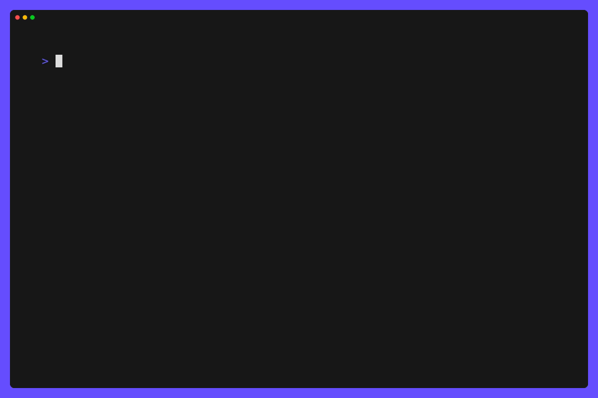

# Recipe TUI

This Terminal App is powered by [charmbracelet's](https://github.com/charmbracelet) **BubbleTea** Terminal User Interface (TUI) [framework](https://github.com/charmbracelet/bubbletea) based on the [Elm Architecture](https://guide.elm-lang.org/architecture/).

As part of learning this framework and the architecture I went ahead and created a **recipe tui** application which lets you browse different meal recipes right from your geek comfort zone _aka_ The Terminal :sunglasses:

Meal API Source: [Link](https://www.themealdb.com/api.php)

## Demo

This demo was created using another amazing tool by charmbracelet team called [vhs](https://github.com/charmbracelet/vhs)

## Releases

For the binary release at ease I have used [go-releaser](https://goreleaser.com/)
